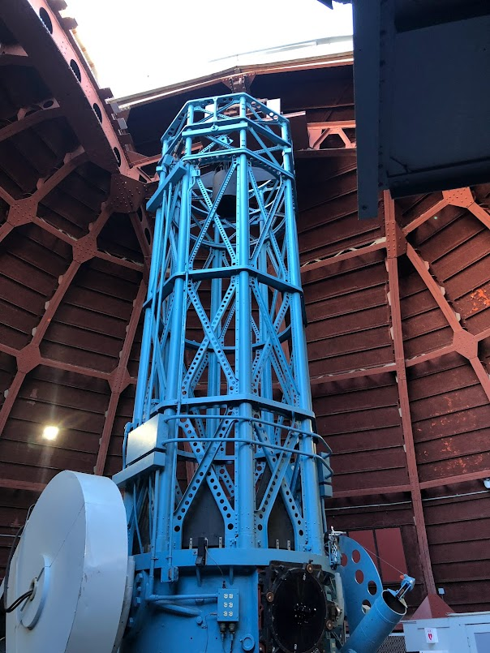

# Mt-Wilson-Workshops 

mantained by Chandru Narayan - [chandru.narayan@bush.edu](mailto://chandru.narayan@bush.edu)

This repository has been created to serve as a landing page for Astronomy Workshops being planned at Mt Wilson.  The primary purpose if this site to allow for all particpants to reach various locations on the internet to access files and other resouces needed for the workshops including with schedules and attendee information. 

More importantly this website will hopefully help us by preventing digging through lots of emails to find link, resources or schedules as we apprach each of the Mt Wilson workshop. I have mined yoru emails and provided links to the original locations. If they are mainteained as specified, the links in this website should continue to work and provide up to date information including any updates you may make in the future.

Some of these locations may not be accessible as they might be passwords protected and you might have to request the owner of these locations for access.

This repository is available for public access for those who have the links, so I will take care not to include phone numbers and other personal information here.  I will gladly maintain this site for the 3 workshops mentioned below and any new ones we may do.  Please let me know if this is useful and if you would like to use it.

Kindly, Chandru

### Schedule of Workshops

Dates|Workshop|Content/Student Leads|Technical Leads|Number of Participants|Overall Purpose/Agenda
:---|:---|:---|:---|:---|:---:
May 16|[Engineering Run](engineering)|Reed Estrada, Kalee Tock|Joseph Burch, Alexander K, Tom Smith|6-10|Equipment & Software Checkout for upcoming workshops
Jun 19-20|[Bush & Paso Robles High Schools](bushpaso)|Chandru Narayan, Jon-Paul Ewing|Joseph Burch, Alexander K, Leon Bewersdoff|20-25|Equipment & Software Checkout for upcoming workshops
Jun 26-27|[InStAR Imaging](instar)|Rachel Freed, Kalee Tock|Joseph Burch, Alexander K, Tom Smith|6-10|Speckle Imaging of Globular & Open luster Doubles, Time Series Imaging for new Exoplanets and Variable Stars

### Links for Workshop Resources

No.|Contributor|Resource
:---|:---|:---
1.|Joseph Burch/Alexander K|[Google Drive To Do List and NINA resources upcoming Workshops](https://drive.google.com/drive/folders/1N_8PJXVt-bxaEPOeWJJln_dxDEbLngll?usp=sharing)
2.|Leon Bewersdorff/Nick Hardy|[Leon/Nick's amazing NINA Browser Plugin version 1.0.5.3](https://drive.google.com/file/d/1DDfk6JIjIr8YannYIvoKHSm5wiio0v6d/view)
3.|Tom Smith|[Target List (Play List) Format for NINA](target_list_format.pdf)
4.|Tom Smith|[Tom's magical File Copy App Help Documentation](FileCopyHelp.pdf)
5.|Tom Smith|[Tom's wonderful Star Cluster Search Python Program]()
6.|Kalee Tock|[Google Drive for Exoplanet Data](https://drive.google.com/drive/olders/1bUdg7aniibfqsm30sNgyn3zKK5qs4tq0)
7.|Reed Estrada|[Google Drive for Speckle Interferometry Data](https://docs.google.com/document/u/0/d/1dFaNgAwE7uvuMEgTnrJmzSu0gu5Twrwv8XwlbSihxEw/edit)
8.|Scott Dixon|[Scott's Year Long Target List for CDK 24](year_long_target_list.csv)
