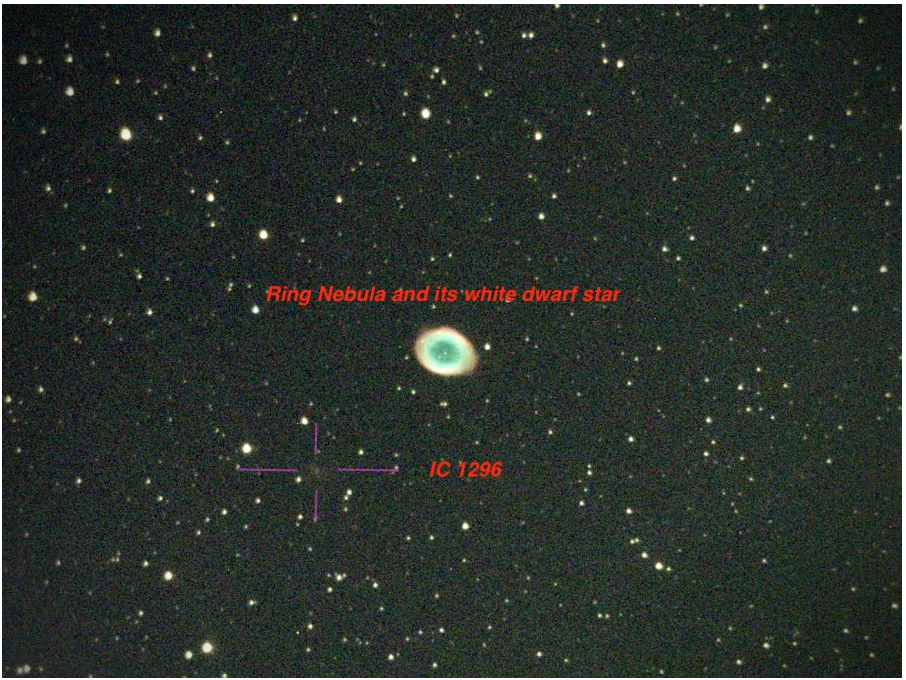

# Bush & Paso Robles High School Workshop

### Goals for the Bush School Paso Robles High School - Chandru Narayan & Jon-Paul Ewing

This workshop is designed for High School Stuents - many of them getting their first (physical) views through an actual telecope.  The come from diverse backgrounfds and have varying levels of exposure to Astronomy.  Some of these students are accompanied by their parents who will join them during the workshop on daytime tours of the Mt Wilson Facilities and a select few will also accompany them during the observing nights on the 60" telescope.  

There will be about 20 students divided into teams of 4 teams of 5 students each with a parent or two tagging along per team. We expect to start observing asoon as darkness falls (8:00 PM?) and go till midnight or 1:00 AM at the latest. Each team will proabably use up to 45 mins at the telescope.

The students have 3 main and one optional goals:

1.  A daytime tour of the 60", 100" telescopes, CHARA and other locations at the Mt Wilson Observatory (June 19th afternoon or June 20th depending on Tom Meneghini's availability)
1.  Image a double star and gather data to measure the primary and seconday stars for their Sep and PA for later plotting and analysis
1.  Image a close double and gather data for performing Speckle Interferometry leading to a publication of their findings
1.  (Optional) Observe via eye piece (if this is possible) and/or image (get a pretty picture) one or two bright deep sky objects such as a globular/open cluster, galaxy (examples M57 Ring Nebula, M81 cigar galaxy, M51 whirlpool , M13 glob, etc). Collect data as FITS files for stacking and image processing purposes.  

We are not planning on a time-series observations for Exoplanet or variable star observing due to much longer times needed on the telescope.

### Links for Workshop Resources

For information on [technical resources please refer to this page](https://chandrunarayan.github.io/Mt-Wilson-Workshops/#links-for-workshop-resources)

